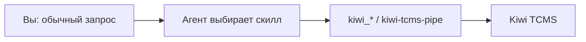

# Примеры: как работают скиллы

Скилл — это не чат-бот и не отдельная программа. Это инструкция, которую
агент (Claude, Grok, Codex, Cursor) читает, когда ваша фраза попадает в
`description`. Дальше он вызывает `kiwi_*` и/или репортер.

Ниже — типичные диалоги. Имена планов и id вымышленные.



## 1. Написать кейсы и завести в план

**Фраза:** «Напиши кейсы на оплату по QR и заведи их в план „Платежи, спринт 24“».

**Скилл:** `kiwi-write-test-cases` (часто после короткого `kiwi-qa-thinking`).

Что делает агент:

1. `kiwi_ping` — жив ли MCP, какой `KIWI_PROJECT`.
2. `kiwi_list_plans(query: "Платежи, спринт 24")` — план #31 или
   `kiwi_create_plan`.
3. `kiwi_search_cases(query: "QR")` — что уже есть, чтобы не дублировать.
4. Спрашивает объём: smoke / balanced / exhaustive.
5. Показывает чек-лист. Вы убираете 2 пункта, добавляете 1.
6. Пишет `tests/manual/*.md` в формате `## Setup` / `## Steps` / `## Expected`.
7. `kiwi_list_priorities` / `kiwi_list_categories` — только реальные имена
   инстанса.
8. На каждый согласованный кейс: `kiwi_search_cases` → `kiwi_create_case`.
9. В заголовок файла дописывает `TC-412`.

**Итог:** «Создано 11 кейсов в плане #31. Дубль „повторное сканирование“ связан
с TC-388, не клонирован. Ссылка: `https://kiwi.example/plan/31/`».

Не путать с `kiwi-explore-plan` (чартер исследования) и
`kiwi-improve-test-cases` (править уже существующие).

## 2. «Что может сломаться?» до кейсов

**Фраза:** «Подумай как QA над возвратом товара».

**Скилл:** `kiwi-qa-thinking`.

Линзы: границы, негатив, состояния, гонки, злоупотребления, деньги/TZ,
неочевидное. Затем `kiwi_search_cases(query: "возврат")`.

**Итог — таблица:**

| Сценарий | Линза | Риск | В Kiwi |
| --- | --- | --- | --- |
| Полный возврат | позитив | средний | TC-210…TC-213 |
| Частичный возврат | граница | высокий | нет |
| Двойной возврат той же позиции | идемпотентность | высокий | нет |
| Подмена суммы в запросе | злоупотребление | высокий | нет |

Дальше агент предлагает `kiwi-write-test-cases` только на gaps.

## 3. Синхронизация Markdown ↔ Kiwi

**Фраза:** «Синхронизируй `tests/manual` с планом „Регресс 1.4“».

**Скилл:** `kiwi-sync-test-cases`.

1. Обход `*.md` с заголовком `# TC-…` или без id.
2. Есть `TC-412` → `kiwi_get_case(412)`, сравнение полей, при расхождении —
   в сводку на `kiwi_update_case`.
3. Нет id → поиск по summary; 0 хитов → создать; 1 хит → вписать `TC-<id>`;
   несколько → спросить вас.
4. Кейсы, которых нет локально, **не удаляются**. Только отчёт.

**Итог:** создано 2 · обновлено 4 · связано 1 · без изменений 11.

Обратный путь (Kiwi → файлы): «выгрузи план #12 в markdown».

## 4. Почистить «дряблую» базу

**Фраза:** «Почисти кейсы плана „Корзина“».

**Скилл:** `kiwi-improve-test-cases`.

`kiwi_search_cases(plan: 18)` → `kiwi_get_case` на каждый → балл /10
(один результат, глаголы, конкретные данные, наблюдаемость, …).

Кейсы < 7 переписываются. Смысл не меняется. Массовый `kiwi_update_case`
после вашей сводки.

**Итог:** средний балл 6.1 → 8.4; 3 мульти-проверки разбиты на 6 кейсов.

## 5. Подключить репортинг автотестов

**Фраза:** «Чтобы прогон Playwright сам писал результаты в Kiwi».

**Скилл:** `kiwi-e2e-tests-reporting`.

1. Видит `playwright.config.ts`.
2. Ставит `@kiwi-tcms-ai/kiwi-tcms-reporter` через `file:`.
3. Вешает адаптер:

```ts
reporter: [
  ["list"],
  ["@kiwi-tcms-ai/kiwi-tcms-reporter/playwright", { plan: 12, build: process.env.CI_COMMIT_TAG ?? "dev" }],
]
```

4. Просит пометить тесты: `test("… [C412]")` или `{ tag: ["@C412"] }`.
5. Первый прогон — `--dry-run` / `dryRun: true`. Несопоставленные — в лог.
   `createMissing` только после разбора.

Jest / Mocha — свои адаптеры. Pytest, Java, C# — JUnit XML и `kiwi-tcms-pipe`.
Флаги не выдумываются: `kiwi-tcms-pipe --help`.

## 6. Прогнать сюит и увидеть ран

**Фраза:** «Прогони e2e и положи результаты в Kiwi, сборка 1.4.2-rc1».

**Скилл:** `kiwi-run-tests-with-reporter` (репортинг уже должен быть подключён).

1. Активного рана на план #12 нет → репортер с `plan: 12, build: "1.4.2-rc1"`
   создаёт ран #93.
2. Прогон: 214 тестов, 9 упало. Ошибка синка **не роняет** процесс.
3. `kiwi_run_status(93)` — числа совпадают с итогом Playwright.
4. `kiwi_list_executions(run: 93, status: "FAILED")` — у падений есть комментарий
   с трейсом.

Дальше — `kiwi-run-triage`.

## 7. Разобрать упавший ран

**Фраза:** «Разбери ран 87, упало 6 тестов».

**Скилл:** `kiwi-run-triage`.

`kiwi_run_status(87)` → 42 PASSED, 6 FAILED, 3 BLOCKED.

| Исполнение | Признак | Класс | Действие |
| --- | --- | --- | --- |
| 4 шт. | `ERR_CONNECTION_REFUSED` к шлюзу | окружение | `BLOCKED` + «перезапустить стенд» |
| 1 | сменился текст кнопки | дефект теста | `BLOCKED`, тег `test-issue` |
| 1 | сумма без скидки | дефект продукта | `FAILED` + `kiwi_execution_add_link` на JIRA-152 |

PASSED агент не трогает. Массовые смены статуса — после подтверждения.

## 8. Автоматизировать ручные кейсы

**Фраза:** «Автоматизируй P1 плана „Оформление заказа“».

**Скилл:** `kiwi-automate-manual-cases`.

1. `kiwi_search_cases(plan: 31, status: "CONFIRMED", automated: false, priority: "P1")` → 8 кейсов.
2. Один чисто визуальный — оставлен ручным с комментарием.
3. 7 Playwright-тестов с `@C412`…`@C418`, селекторы `data-testid` / роль.
4. Локальный прогон только новых тестов. Максимум 3 попытки починить локатор.
5. `kiwi_update_case(id, automated: true)`, тег `level:e2e`.

Связь тест↔кейс — тот же маркер, что читает репортер.

## 9. Карта покрытия и impact в PR

**Фраза:** «Построй карту покрытия и скажи, что гонять в этом PR».

**Скиллы:** `kiwi-test-code-coverage`, затем `kiwi-setup-change-aware-testing`.

Пишет `coverage.tests.yml`:

```yaml
version: 1
coverage:
  src/pricing/discount.ts:
    tests:
      - file: tests/unit/discount.spec.ts
        cases: [C412, C413]
  src/cart/cart.ts:
    tests: []          # дыра
```

`git diff --name-only main...HEAD` задел `discount.ts` → 15 тестов + обязательный
smoke `@critical`. В CI — 23 вместо 644, `build` = sha PR, результаты в Kiwi.
На merge в main — полная сюита.

Проверка YAML (не Python):

```bash
npx js-yaml coverage.tests.yml | node skills/kiwi-test-code-coverage/scripts/check-coverage.mjs
```

## 10. Два взгляда на один PR

**Фраза A:** «Что этот PR должен делать по тикету?»
→ `kiwi-pr-requirements-analyzer`. Читает title, body, `gh pr view`, тикет.
Списки: in scope / out of scope / extra. `kiwi_search_cases` на каждое обещание.
Фикс без регрессионного кейса — всегда gap.

**Фраза B:** «Что реально поменялось в коде?»
→ `kiwi-pr-diff-analyzer`. Смотрит `git diff`, модули, риски, impact-набор
по `coverage.tests.yml`. Не выдумывает AC из тикета.

Их не подменяют друг другом.

## 11. Полный цикл одной командой

**Фраза:** «Прогони полный цикл для фичи „Промокоды“».

**Скилл:** `kiwi-testing-workflow`. Сам ничего не пишет — вызывает других.

```
scan → design → refine → dedupe → coverage → sync → report → triage
```

Состояние в `.kiwi-workflow.yml`. Можно начать с середины: «разбери этот ран»
сразу идёт в triage. Перед create/update/sync — сводка.

Стратегия «с чего начать QA» — это не этот скилл, а
`kiwi-qa-lead-strategy-advisor` (интервью + L1–L5 + дорожный план из живых
метрик Kiwi).

## 12. Исследовательская сессия

**Один раз на проект:** «Подключи exploratory к личному кабинету»
→ `kiwi-explore-setup`. Пишет `.kiwi-explore.yml` (`allowed_hosts`,
`forbidden_actions`, `plan_id`), smoke-обход браузерного агента, пробный кейс
`[exp]`.

**Перед сессией:** «Чартер на оплату сбоку, 25 минут» → `kiwi-explore-plan`.

**Во время:** «Запусти сессию» → `kiwi-explore-fundamentals`.

- двойной клик «Оплатить» → два списания → исполнение + `kiwi_execution_add_link`
  + скриншот;
- уход со страницы на середине → кейс «брошенный заказ»;
- таймбокс 25 мин — стоп, даже если «ещё интересно».

Находка, не записанная в Kiwi, считается не найденной.

## 13. Allure уже есть

**Фраза:** «Переложи `allure-results` последнего прогона в ран 96».

**Скилл:** `kiwi-allure-adapter`. Отдельного Allure-продукта нет.

Парсит `*-result.json` → JSON pipe →
`kiwi-tcms-pipe --format json --run 96`.
`broken` и `failed` оба становятся FAILED, тип пишется в комментарий.
Вложения — `kiwi_rpc TestExecution.add_attachment`.

## 14. MCP «не работает»

**Фраза:** «kiwi_* не находятся / 401».

**Скилл:** `kiwi-mcp-usage`.

Лестница: конфиг агента → логин/пароль (не печатать) → `kiwi_ping` → 404 на
`/json-rpc/` значит кривой `KIWI_URL` → handshake.

По имени: приоритет, категория, статус. По id: план, кейс, ран, исполнение.
Сначала `kiwi_ping`, потом справочники, потом мутации.

## Какой скилл не брать

| Хотите | Не тот скилл | Тот |
| --- | --- | --- |
| Чартер исследования | `kiwi-write-test-cases` | `kiwi-explore-plan` |
| Поправить существующие кейсы | `kiwi-write-test-cases` | `kiwi-improve-test-cases` |
| Весь цикл | любой узкий | `kiwi-testing-workflow` |
| Зрелость / «с чего начать» | `kiwi-testing-workflow` | `kiwi-qa-lead-strategy-advisor` |
| Дубли автотестов | `kiwi-detect-duplicate-test-cases` | `kiwi-automation-consolidation` |
| Намерение PR | `kiwi-pr-diff-analyzer` | `kiwi-pr-requirements-analyzer` |
| Diff кода | `kiwi-pr-requirements-analyzer` | `kiwi-pr-diff-analyzer` |
| Только прогнать в ран | `kiwi-e2e-tests-reporting` | `kiwi-run-tests-with-reporter` |
| Только воткнуть репортер | `kiwi-run-tests-with-reporter` | `kiwi-e2e-tests-reporting` |
